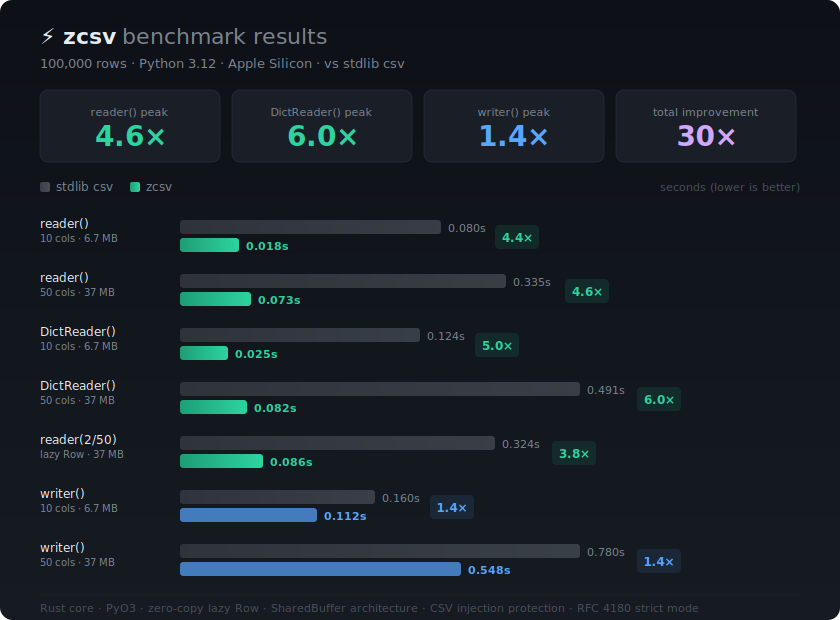

<div align="center">

# zcsv

**Blazing-fast drop-in replacement for Python's `csv` module, powered by Rust.**

`import zcsv as csv` — same API, 4-6x faster.

[](LICENSE)
[](https://www.python.org)
[](https://www.rust-lang.org)

<br>



</div>

---

## Why zcsv?

Python's built-in `csv` module is implemented in C but still creates Python objects for every field of every row. For a 100K-row file with 50 columns, that's **5 million** string allocations just to iterate.

zcsv eliminates this. The Rust core parses CSV via SIMD instructions into a single contiguous buffer. The Python-facing `Row` object is a **zero-copy cursor** — it holds a pointer and an index, nothing more. Python strings are created **only when you access a field**, and only for the fields you actually use.

### Features you won't find elsewhere

- **CSV Injection Protection** — `safe=True` escapes `=`, `+`, `-`, `@`, `\t`, `\r` (OWASP best practice)
- **RFC 4180 Strict Mode** — `strict=True` validates field counts, quoting rules, with line numbers in errors
- **Delimiter Autodetection** — frequency analysis in Rust (`,` `;` `\t` `|` `:`)
- **Encoding Autodetection** — UTF-8, UTF-16 (LE/BE), Latin-1, BOM handling
- **Automatic Type Inference** — `zcsv.read()` returns typed `list[dict]` (int, float, bool, str)

---

## Install

```bash
pip install zcsv
```

**From source** (requires Rust toolchain):

```bash
git clone https://github.com/Seinarukiro2/zcsv.git
cd zcsv
pip install maturin
maturin develop --release
```

---

## Quick Start

### Drop-in replacement

```python
import zcsv as csv

# Exactly like stdlib — but 4x faster
with open("data.csv") as f:
    for row in csv.reader(f):
        print(row[0], row[1])

# DictReader — 6x faster
with open("data.csv") as f:
    for row in csv.DictReader(f):
        print(row["name"], row["age"])

# Writer — 1.4x faster
with open("out.csv", "w", newline="") as f:
    w = csv.writer(f)
    w.writerow(["name", "age"])
    w.writerows([["Alice", "30"], ["Bob", "25"]])
```

### zcsv extensions

```python
import zcsv

# Read with automatic type inference
data = zcsv.read("data.csv")
# [{"name": "Alice", "age": 30, "active": True}, ...]

# Batch reading for large files
for batch in zcsv.read_batches("huge.csv", batch_size=10_000):
    process(batch)

# Write with CSV injection protection (safe=True by default)
zcsv.write("out.csv", data)
```

---

## API Reference

### `zcsv.reader(csvfile, **kwargs)`

Returns a cursor iterator. Each iteration advances to the next row. Access fields with `row[0]` (by index) or `row.to_list()` for a full list.

```python
with open("data.csv") as f:
    for row in zcsv.reader(f):
        name = row[0]          # lazy — creates Python string only now
        last = row[-1]         # negative indexing works
        print(len(row))        # field count
        print(repr(row))       # ['Alice', '30', 'NYC']
```

**Storing rows:** The cursor reuses the same object. To collect rows, use `snapshot()`:

```python
with open("data.csv") as f:
    rows = [row.snapshot() for row in zcsv.reader(f)]
    # or: [row.to_list() for row in zcsv.reader(f)]
```

**Parameters:** `delimiter`, `quotechar`, `strict` (RFC 4180 validation)

### `zcsv.DictReader(f, fieldnames=None, **kwargs)`

Same cursor pattern with dict-like access:

```python
with open("data.csv") as f:
    for row in zcsv.DictReader(f):
        row["name"]           # by key
        row[0]                # also by index
        row.keys()            # column names
        row.values()          # all values
        row.items()           # (key, value) pairs
        row.get("x", "N/A")  # with default
        "name" in row         # membership test
```

### `zcsv.read(path, **kwargs) -> list[dict]`

Read entire file with automatic type inference.

```python
zcsv.read("data.csv",
    delimiter=None,       # None = autodetect
    has_header=True,
    schema={"id": int, "price": float},  # override types
    skip_rows=0,
    max_rows=None,
    columns=["name", "age"],  # select columns
    null_values=["", "NA", "null", "None"],
    encoding=None,        # None = autodetect
    strict=False,         # RFC 4180 validation
    n_threads=None,       # parallel type conversion
)
```

### `zcsv.write(path, data, **kwargs)`

```python
zcsv.write("out.csv", data,
    delimiter=",",
    safe=True,    # CSV injection protection (default: True)
    strict=False,
)
```

### `zcsv.writer(csvfile, **kwargs)` / `zcsv.DictWriter(csvfile, fieldnames, **kwargs)`

Stdlib-compatible streaming writer. `safe=False` by default (stdlib compat).

### `zcsv.read_batches(path, batch_size=10_000, **kwargs)`

Memory-efficient iterator yielding `list[dict]` batches.

---

## Architecture

```
Python API        ┌─ reader() ─── cursor Row (zero-copy, lazy strings)
                  ├─ DictReader() ─── cursor with field names
                  ├─ writer() / DictWriter() ─── raw FFI serialization
                  ├─ read() ─── type inference + parallel conversion
                  └─ write() ─── CSV injection protection

Rust Core         ┌─ simd-csv ─── SIMD-accelerated CSV parsing
(PyO3 + FFI)      ├─ SharedData ─── single Vec<u8> buffer for all rows
                  ├─ memmap2 ─── memory-mapped I/O for large files
                  ├─ rayon ─── parallel column type conversion
                  ├─ encoding_rs ─── charset detection + conversion
                  └─ fast_pyobjects ─── raw CPython FFI (PyUnicode_New, PyList_SET_ITEM)
```

### Key design decisions

- **Zero-copy Row:** All CSV data lives in one contiguous `Vec<u8>`. `Row` is `Arc<SharedData> + u32` — 12 bytes, no per-row heap allocation. Python strings created only on field access via raw `PyUnicode_New`.
- **Cursor pattern:** `reader.__next__()` returns `self` with `Py_INCREF` (~10ns) instead of allocating a new object (~900ns).
- **String dedup cache:** Repeated values (countries, categories, booleans) are cached. Auto-disables after 200 samples if hit rate < 20%.
- **GIL release:** File I/O, SIMD parsing, type inference, CSV serialization all run with GIL released.

---

## Benchmarks

100,000 rows, Python 3.13, Apple Silicon M4:

| Operation | stdlib `csv` | `zcsv` | Speedup |
|-----------|-------------|--------|---------|
| `reader()` 10 cols | 0.080s | 0.018s | **4.4x** |
| `reader()` 50 cols | 0.335s | 0.073s | **4.6x** |
| `DictReader()` 10 cols | 0.124s | 0.025s | **5.0x** |
| `DictReader()` 50 cols | 0.491s | 0.082s | **6.0x** |
| `writer()` 10 cols | 0.160s | 0.112s | **1.4x** |
| `writer()` 50 cols | 0.780s | 0.548s | **1.4x** |

---

## License

MIT
